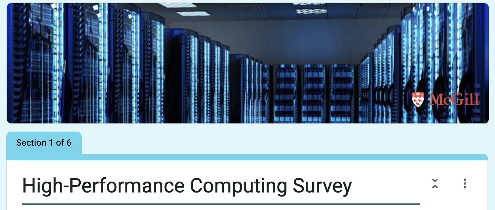

# Roadmap

## Vision
The vision of this project is to working with women, racialized groups, and students from underprivileged countries at McGill University to teach high-performance computing skills and inform them about available resources so that they can execute their research projects and coursework more effectively. 
The choice to implement open-science approach is to maximize the quality of this project through feedback and collaboration and the amount of students we can reach.

## Goals
1. **Expand Access to High-Performance Computing Resources**  
   Increase awareness and make sure that students from underrepresented groups and underprivileged backgrounds have access to the necessary computational tools and infrastructure.

2. **Deliver Targeted Training Programs**  
   Develop and implement workshops or courses focused on high-performance computing skills and make those available to the target group.

## Milestones

### Phase 1: Survey Design and Distribution
- [x] Survey Design - Expected Completion: December 2024

[The survey link HERE:](https://docs.google.com/forms/d/e/1FAIpQLSd0Stg3x9fXU0WVzLmmPygJAg56lRoAgxSnBuBBfj9cHW9ItA/viewform?usp=header)
   

- [ ] REB1 Approval - Expected Completion: January 2025
- [ ] Survey Distribution - Expected Completion: February 2025

### Phase 2: In-person Workshop Design
- [ ] Confirm guest speaker - Expected Completion: February 2025
- [ ] Design workshop format and material - Expected Completion: March 2025
- [ ] Book the room and the date
- [ ] Advertise 

### Phase 3: Execute Workshop
- [ ] Conduct in-person workshop - Expected Completion: April 2025
- [ ] Distribute and collect a post-workshop survey - Expected Completion: April 2025

## Future Directions
OLS-9 Graduation Presentation: https://docs.google.com/presentation/d/1xKe6h3-Xgl2dlGB8u-TSTE_XW2zAptU8glqzzfQqKSQ/edit?usp=sharing
## How to Contribute
